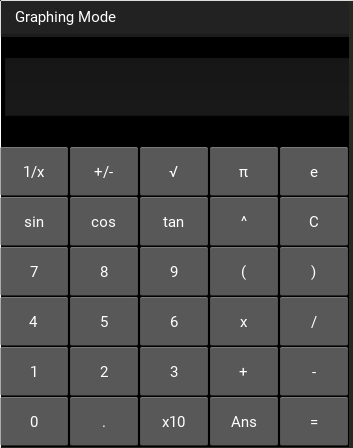

# Calculator
A calculator written in python and kivy with a standard calculation mode and a graphing mode using reverse polish notation
and the shunting yard algorithm. Currently all the standard operators such as +,-,/,* (including unary - and +) and ^
are implemented as well as sin,cos and tan (in radians).

Also in the graphing mode there is support for animation by adding a variable and setting a maximum and minimum
then pressing the "play" button.

### Known Issues:
* In graphing mode equations like `(x+3)(x-2)` do not work as a * must be put in between them

### Todo:
* Add automatic changing of the grid line frequency and labels on zoom in/out
* Adjust how zooming is handled, make it so that it zooms around the mouse point
* Add adjustable precision (decimal module?) so jagged lines don't start showing when zoomed in
* Add parametric equations